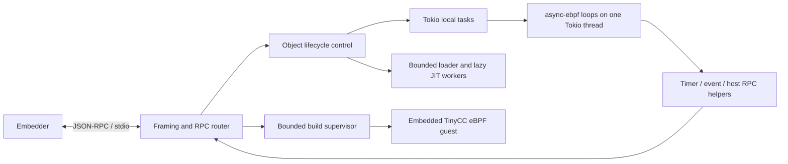

# spinfoam design proposal

Status: implemented initial version; based on source inspection on 2026-09-16. The object runtime, SDK, protocol and sandboxed compiler are implemented and tested. See [README.md](README.md) and [the protocol reference](docs/PROTOCOL.md) for the implemented interface; performance measurements are recorded separately. The memory budget below remains a design estimate, not an enforced limit.

Build a Linux/macOS x86_64/arm64 Rust executable that runs independent, long-lived userspace eBPF loops on a Tokio current-thread runtime. The embedder controls it through bidirectional JSON-RPC over stdio. Each loop can await timers, incoming events, and capability-checked RPCs to the embedder while preserving its C stack and mutable globals. Compilation is a separate, sandboxed service in the same protocol.

The embedder owns placement, replication, durable storage, restart policy, credentials, external connections, and distributed coordination. spinfoam owns local execution, isolation between object files, cancellation, and bounded message delivery. Each loaded object is managed independently; any grouping or ownership model belongs to the embedder. There is no kernel eBPF dependency, distributed scheduler, HTTP listener, or built-in GitHub/Home Assistant client.

## 1. What the existing projects provide

Inspected async-ebpf at `7e8a7cbce195d68a1d579608b7a28b55f6fce7fd` and zeroserve at `335b778a125f29d3e00ec93df486e02d0adb2abf`. Both working trees were clean. spinfoam initially contains only its README and license.

| Source | Relevant finding | Design consequence |
| --- | --- | --- |
| [async-ebpf program.rs](../async-ebpf/src/program.rs) | `ProgramLoader::load` produces `UnboundProgram`; `pin_to_current_thread` produces a deliberately `!Send`/`!Sync` `Program`. | Load on a bounded worker pool; execute on one fixed thread. Never wrap a live program in an unsafe `Send` adapter. |
| Same | `HelperScope::post_task` suspends the coroutine and runs a completion callback with a fresh helper scope. | Implement sleep, event receive, and host RPC as ordinary-looking C calls that await internally. |
| Same | `run_mut` holds an exclusive lease on persistent writable ELF data for the entire invocation. | One long-lived invocation per object; globals and stack survive waits. A second invocation must not be used to deliver an event. |
| Same | `Timeslicer` has `sleep`, `yield_now`, and `run_blocking`. Preemption uses SIGUSR1 and a watcher thread per execution thread. | Implement the adapter with Tokio and bounded blocking work. Account explicitly for the auxiliary watcher. |
| Same | Defaults: 1 MiB native code limit, 32 KiB guest frames plus 512 bytes calldata; native stack derives from frame count plus a 16 KiB reserve. | Measure code residency and tune the code-arena setting if needed; it is not an aggregate program-memory quota. Keep the small default guest-stack budget. Do not assume a 1 MiB native coroutine stack merely because the stack type has that default constructor. |
| Same | Execution contexts are scrubbed on reuse but returned to an unbounded thread-local pool. | Measure high-water retention; consider a bounded pool/trim API if needed. Unload does not promise immediate stack-memory reclamation. |
| [async-ebpf linker.rs](../async-ebpf/src/linker.rs), [loader-limit tests](../async-ebpf/src/test/loader_limits.rs) | Existing aggregate limits prevent known loader amplification. Instruction limits are per section. | Retain upstream validation and measure loader costs; do not add allocation accounting or stricter object-shape limits solely to enforce the 1 MB target. |
| [Proof scope](../async-ebpf/docs/jit-memory-safety.md), [Lean project](../async-ebpf/lean/README.md) | The x86_64 core establishes memory-safety properties under an entry/runtime contract. Helpers, signal handling, mappings, and trampolines remain trusted. Functional correctness and information-flow security are not the native-code theorem. | Same-process execution of independent untrusted objects is the intended model; spinfoam's helper boundary and resource controls remain essential. Keep the x86_64 proof scope explicit; arm64 uses the upstream arm64 backend without claiming that proof. |
| [zeroserve script.rs](../zeroserve/src/script.rs), [helpers](../zeroserve/src/helpers), [SDK](../zeroserve/sdk/zeroserve.h) | Named ELF sections, symbol-based helper registration, typed execution context, object handles, memory charges, async completion callbacks, runtime adapter. | Reuse the helper/SDK patterns with a persistent object context; defer memory charging. |
| [zeroserve compiler](../zeroserve/src/bpf_compiler.rs), [SDK staging](../zeroserve/src/script_compile.rs) | The SDK targets little-endian BPF v3 and 4096-byte frames. | Keep the compiler/runtime ABI pairing with the TinyCC guest targeting eBPF. |
| [zeroserve memory benchmark](../zeroserve/benchmark/memory/memory_benchmark.md) | Measures whole server processes and reports roughly 1.2 MB PSS per instance under its workload. | Useful measurement precedent, but not evidence that spinfoam meets either performance requirement. |

Do not import zeroserve's request model, 64-frame guest-stack setting, monoio integration, HTTP/TLS stack, or compiler defaults. Use a pinned async-ebpf revision during development and an exact qualified release for distribution.

## 2. Runtime structure



Use `Builder::new_current_thread().enable_all()` with a `LocalSet`. Tokio supports non-`Send` tasks through [LocalSet](https://docs.rs/tokio/latest/tokio/task/struct.LocalSet.html). Initialize `GlobalEnv` once and `ThreadEnv` on the execution thread; retain the preemption token while guest execution is possible. Guest futures never migrate.

Spawn one local Tokio task per loaded object. That task owns its run future and cancellation handling. Tokio schedules runnable tasks; async-ebpf preemption and its Tokio timeslicer provide yield points even for tight guest loops. Waiting objects wake through timers, mailbox events, or RPC completion. Start with this direct integration, without a custom scheduler, weighted queues, or CPU-accounting layer.

Use a small bounded blocking executor for application-object load and lazy JIT. Compiler requests use an unrestricted adapter; their admission belongs to the embedder. `Timeslicer::run_blocking` acquires admission before submitting work, then awaits completion; do not submit thousands of jobs into an unbounded queue. Tokio's [blocking task API](https://docs.rs/tokio/latest/tokio/task/) runs blocking work on auxiliary threads. Once started, these jobs may outlive cancellation; retain their concurrency permits until actual completion, and observe any memory retained by detached work.

The requirement is **10,000+ live programs on one execution OS thread**. The process also has async-ebpf's watcher and bounded loading/JIT workers; compiler guests share the execution thread. Exactly one OS thread for the entire process is incompatible with the present async-ebpf preemption mechanism. Report all thread counts in benchmarks.

Use nonblocking stdio pipes through Tokio's Unix FD integration for the initial Unix deployment. Keep one reader and one writer, separate from request execution. Document supported descriptor types and reject unsupported ones at startup; do not accidentally turn a blocked stdin read into an uninterruptible shutdown dependency.

## 3. Object identity and lifecycle

Each loaded object file is an independent execution unit: one `object_id`, one async-ebpf `Program`, one invocation of `spinfoam.main`, private mutable globals, one mailbox, one handle table, and one cancellation token. Configuration and allowed host capabilities attach directly to that object. There is no ownership hierarchy or separate instance API. Loading the same ELF bytes twice creates two independent objects with different IDs and execution state.

A build artifact is just immutable ELF bytes plus hash, SDK ABI and compiler metadata. Building executes the compiler guest, but does not execute the emitted program. `sf.object.load` accepts ELF bytes and creates a loaded object; the artifact is not a parent runtime entity. Sharing compiled code or mutable state between loaded objects is not required.

Object states: `loaded -> starting -> running -> stopping -> stopped`, with `exited` and `failed` terminal alternatives. `running` includes waiting for timer/event/RPC, exposed separately as a wait reason. Object IDs are never reused within a session; session identity distinguishes process restarts.

`sf.object.start` starts a loaded object once and acknowledges scheduling, not successful execution of every lazy-compiled path. Compile/run failures produce terminal state with structured diagnostics. A return from `spinfoam.main` terminates normally. No automatic restart. `sf.object.stop` cancels helper waits and drops the run future on its owner thread, including the writable-data lease; it acknowledges after guest resources and routing entries are detached. Detached JIT jobs may delay final memory reclamation, exposed in status.

`sf.object.unload` stops the object if necessary and removes its record. Repeated stop/unload requests are safe to handle idempotently. To restart or replace a program, load a fresh object with a new ID. Stale deliveries and host responses cannot target the replacement. No transparent live migration or raw-stack checkpointing. Explicit application state can be sent to the embedder and provided as config on a later load. Keep terminal history bounded.

On stdin EOF, broken stdout, or fatal framing failure: cancel all objects and builds, reap child processes, wait a bounded interval for local work, then exit. The embedder observes process exit and owns recovery. Local state is intentionally volatile.

## 4. Stdio protocol

Use JSON-RPC 2.0 with one UTF-8 JSON value per line. Embedded newlines are JSON escapes. stdout contains protocol frames only; diagnostics go to stderr. Both sides continuously read while requests are outstanding. JSON-RPC defines requests, responses and notifications; notifications do not receive responses ([specification](https://www.jsonrpc.org/specification)).

Version 1 is a negotiated profile with string IDs, named parameters, and no batch requests. `initialize` advertises protocol/SDK versions, target architecture, compiler availability, effective limits, runtime revision and a new session ID. Reject unsupported versions before accepting work. Method names use `sf.*` for requests to spinfoam and `host.*` for reverse requests. Use direction-specific ID prefixes and session-unique outbound IDs.

Suggested initial framing limit: 256 KiB including JSON/base64 expansion, checked incrementally before allocation beyond the cap. Oversized unterminated frames close the session; bounded malformed frames get parse errors. Enforce JSON depth, collection counts, string lengths and decoded-byte limits too. Cap outstanding non-compilation control requests and reserve router/writer space for replies, cancellation and shutdown. Event admission must fail promptly instead of blocking the reader behind a full mailbox; host responses must remain routable under load.

| Method | Purpose |
| --- | --- |
| `sf.initialize` | Negotiate the session and discover effective limits. |
| `sf.build.compile` | Compile sources and return ELF bytes and diagnostics in the response. |
| `sf.object.load/start/stop/unload/get/list` | Load ELF bytes with config/capabilities; control its loop and inspect status. Lists are paginated. |
| `sf.event.deliver` | Deliver `{object_id, event_id, topic, payload}`; return admission result. |
| `sf.stats` | Bounded process and object counters. |
| `sf.shutdown` | Stop accepting work, cancel/reap, flush a bounded final response, exit. |
| `host.call` (reverse request) | Guest requests a named, allowed capability with JSON parameters and deadline. |
| `host.cancel` (reverse notification) | Best-effort cancellation of a previously issued host request. |
| `sf.object.state`, `sf.log` (notifications) | Advisory state/log events; authoritative status remains queryable. |

Use standard JSON-RPC errors for malformed calls and stable application codes for `BUSY`, `MAILBOX_FULL`, `OBJECT_NOT_FOUND`, `CAPABILITY_DENIED`, `BUILD_FAILED`, `SANDBOX_UNAVAILABLE`, `PROGRAM_FAULT`, and `DEADLINE_EXCEEDED`. Expected guest-visible failures become SDK status values, not fatal helper errors.

Example reverse call and response, on the same stdio connection:

```json
{"jsonrpc":"2.0","id":"sf:session7:42","method":"host.call","params":{"object_id":"o9","capability":"github.run.read","arguments":{"run_id":"123"},"timeout_ms":10000,"max_result_bytes":8192}}
{"jsonrpc":"2.0","id":"sf:session7:42","result":{"status":"completed","conclusion":"success"}}
```

The host must respond using the same ID; no separate `rpc.resolve` method is needed. Route responses from the pending-request table, never by guest-provided object identity. Validate result size/schema limits before retaining a result. Unknown, duplicate, expired or previous-session responses are discarded and counted. Removing a pending request releases its queue slot and owned buffers exactly once.

Guest notification of an important condition should use an acknowledged `host.call` capability such as `agent.notify`, with an application deduplication key. Success means the embedder acknowledged acceptance. Protocol notifications and pipe writes alone provide no durable delivery guarantee. An external side effect may already have occurred when a call times out; spinfoam does not automatically retry it.

`sf.event.deliver` success means admitted to volatile memory, not processed or durable. FIFO order is the admission order for one object; no cross-object ordering. Bound mailboxes by bytes and count, initially 32 KiB and 32 entries, and return `MAILBOX_FULL` on overflow. A bounded recent-ID window supports retry deduplication but makes no unlimited exactly-once promise. Device-state coalescing can happen in the embedder before delivery; the initial runtime preserves FIFO events without coalescing. A workload requiring processed acknowledgements sends an explicit `host.call` after processing; the embedder maintains the durable event ledger.

Bound outbound queues globally and per object. Essential guest calls wait asynchronously for capacity with a deadline; logs are rate-limited and may be dropped with a counter. The writer drains object queues in round-robin order, with reserved control capacity. If the peer stops draining stdout, outbound buffering stays bounded and calls time out. One stdio stream necessarily has head-of-line blocking; bounded frame sizes limit its unit of blockage but cannot remove it.

## 5. C programming model and helper boundary

Embed and expose `spinfoam.h` via `spinfoam --dump-sdk`, following zeroserve's SDK pattern. Export `SF_MAIN` into the `spinfoam.main` ELF section. Helpers are linked by stable names; the runtime fixes SDK ABI and stack profile. Treat arbitrary uploaded objects as untrusted even if they declare the expected ABI.

Minimal SDK surface:

| Helpers | Contract |
| --- | --- |
| `sf_sleep_ms`, `sf_now_mono_ms`, `sf_now_unix_ms` | Awaitable sleep and separate monotonic/wall clocks; clamp durations and check overflow. |
| `sf_event_next(timeout_ms)` | Await one mailbox event, returning an owned handle or a status code. |
| `sf_host_call(capability, params_handle, timeout_ms)` | Await one authorized reverse RPC, returning an owned result handle or status. String parameters use explicit lengths in the raw ABI. |
| `sf_config`, `sf_json_*` | Bounded JSON access/building; immutable views retain their owning root or copy explicitly. |
| `sf_bytes_len/read`, `sf_drop` | Read payload chunks and release owned handles. |
| `sf_log`, `sf_yield` | Rate-limited diagnostics and an explicit scheduling point. |

The raw eBPF helper ABI has five integer arguments. Larger requests use a versioned fixed-layout descriptor copied from validated guest memory; C inline wrappers supply ergonomic signatures. Reserve negative `i64` values for errors and positive values for handles. No host pointer crosses the boundary. Handle IDs are scoped to an object and generation-tagged within its table; stale or cross-object handles fail. Use straightforward handle-count and JSON structural limits to bound individual helper operations. Do not introduce an aggregate allocation ledger for each program.

Start without guest malloc: local buffers, writable globals, and host-owned JSON/byte handles cover these workloads. Add an arena only if examples require it. Large pages or webhook bodies are streamed/chunked by the embedder into bounded events or fetched through bounded RPCs. Do not load multi-megabyte pages into a loop's JSON tree.

Each helper validates its pointer/length arguments with `user_memory`/`user_memory_mut`, then checks operation-specific bounds and capability arguments. For an async operation, copy the bounded input, release all guest/resource borrows, and call `post_task` with an owned `'static` future. Its completion callback revalidates output pointers or installs a result handle using the new scope. Never retain a guest slice, `RefCell` borrow, or `MutableUserMemory` across await. Invalid pointers are guest faults; network failures and operation-limit refusals are ordinary SDK errors that C can handle.

Every privileged helper obtains object identity from the Rust execution context. Neither helper registration entropy nor a guest-supplied object ID is authorization. Allowed capabilities are supplied by the embedder when that object is loaded. Capability policy constrains operations and arguments: for example, the specific GitHub repository/run or device IDs. The embedder enforces the corresponding authorization again and holds credentials. V1 grants no arbitrary network, filesystem, environment, process-spawn, or compiler access to guests.

The program can be ordinary sequential C, schematically:

```c
SF_MAIN int monitor(void) {
    sf_handle config = sf_config();
    for (;;) {
        sf_handle result = sf_host_call("github.run.read", config, 10000);
        if (result >= 0) {
            if (sf_json_string_equals(result, "status", "completed")) {
                sf_handle ack = sf_host_call("agent.notify", result, 10000);
                sf_drop(result);
                if (ack >= 0) { sf_drop(ack); sf_drop(config); return 0; }
                /* Production example retries notification with a stable key. */
            } else {
                sf_drop(result);
            }
        }
        sf_sleep_ms(15000); /* SDK example adds capped backoff and jitter. */
    }
}
```

This sketch illustrates the SDK; complete, tested programs live in [examples/](examples). The SDK examples must explicitly release handles: a lifetime-long invocation cannot rely on request teardown as zeroserve does.

## 6. Scheduling, backpressure and cancellation

Use Tokio local task scheduling and async-ebpf's existing preemption/yield/throttle controls per program. A starting experiment is a 1 ms watcher interval and 1 ms maximum runtime before yield; tune through measurement. These are soft timing targets with OS/signal latency, not real-time deadlines. No custom CPU scheduler, weighted groups, or CPU quota accounting is needed initially.

Bound every synchronous helper's work. Signal preemption of generated code does not make arbitrary Rust helper code interruptible. Parse bounded JSON with structural limits; chunk expensive byte work or move it to bounded workers. Cancellation is selected alongside the run future and propagated into awaited helpers. Once preemption returns control, stopping a spinning guest must not require guest cooperation.

Retain simple operational bounds: bounded protocol frames, mailboxes and outgoing queues, a finite handle count, and bounded object loader/JIT concurrency. These provide backpressure and constrain individual operations; they do not enforce a total resident-memory allowance for a program. Compiler guests have a separate bounded arena and execution deadline. Compilation concurrency and admission belong entirely to the embedder.

## 7. Memory design target

**Less than 1 MB per active program is a design target, not a runtime-enforced limit in the initial implementation.** Optimize for the example workloads and verify their memory use through benchmarks. Do not add allocation ledgers, memory-based admission, object-shape restrictions, or termination on crossing 1 MB. Larger programs may consume more memory; the embedder manages overall process capacity.

For measurement, use 1,000,000 bytes of attributable resident memory per active loaded object, including its program and host state. Report virtual address reservations separately: pointer cages and guarded stacks intentionally reserve inaccessible address space and can exceed 1 MB even when resident usage is small.

Illustrative planning budget, all figures in KiB (1024 bytes); these are neither caps nor measured sizes:

| Component | Planning estimate |
| --- | ---: |
| ELF image including read-only data, mapped/rounded | 64 |
| Packed writable globals/BSS, mapped/rounded | 32 |
| Eight 4096-byte guest frames plus rounded calldata slab | 36 |
| Native coroutine stack, rounded usable pages | 20 |
| Resident native JIT code | 128 |
| Retained loader/JIT analysis, layouts and variant metadata | 192 |
| Configuration, JSON/byte handles and mailbox | 96 |
| Pending host RPC and serialized output buffers | 48 |
| Run future, task/wakers and tables | 32 |
| Allocator/page slack and attributed shared overhead | 128 |
| **Planning total** | **876 KiB = 897,024 bytes** |

The table is an initial sizing exercise to replace with benchmark data. Keep async-ebpf's small default guest-stack profile and measure code residency before changing its arena setting: its 1 MiB code-arena limit is a reservation/cap, not necessarily 1 MiB resident per program. Existing VM limits remain implementation settings, not a mechanism for enforcing this aggregate memory target.

Loader/JIT metadata and transient scratch are important measurement points. A small ELF can describe large BSS or many function variants; record these costs rather than implementing budget-aware allocation or new metadata ceilings now. Retain async-ebpf's existing validation and loader protections. No upstream allocation-accounting API is required for the first implementation.

Report steady-state memory, loading/lazy-JIT peaks, and compiler guest peaks separately. C compilation remains separately sandbox-limited and is outside the active-loop memory figure. Do not hide JIT peaks when discussing process capacity.

Measure execution-context pool retention during unload/churn. async-ebpf currently retains pooled stacks up to the execution thread's high-water mark. Keep its existing scrub on reuse and test isolation between objects. A bounded pool or explicit trimming is a focused follow-up if retained memory is material; it is not a prerequisite for implementing the runtime. Until then, unloading an object does not promise immediate return of all stack memory to the OS.

Guarded frame islands, code permission splits and cages also consume VMAs and kernel page tables. Measure `/proc/PID/maps`, `smaps_rollup`, virtual size, and page-table overhead at 10,000 and 20,000 programs. Check `vm.max_map_count` when qualifying deployments and report mapping failures clearly. Do not disable stack guards merely to improve the benchmark. If deployment defaults are insufficient, document required host configuration or improve mapping strategy upstream.

A useful normal-case goal is 150–400 KiB resident per waiting loop while keeping the target workloads below 1 MB; this is a hypothesis to test. At 10,000 loops even 300 KiB is about 2.86 GiB. Single-thread concurrency is feasible for mostly waiting jobs; it does not promise simultaneous CPU service to 10,000 busy loops. For illustration, 10,000 pollers on 30-second intervals produce about 333 host requests/second before retries. The embedder and stdio throughput must support the chosen rates.

## 8. Sandboxed C-to-eBPF builds

`sf.build.compile` accepts SDK version and a bounded map of relative UTF-8 source/header paths to contents, plus an entry source. Suggested initial limits: 128 KiB aggregate source, 32 files, 64 KiB captured diagnostics, 64 KiB output ELF. Paths reject absolute forms, traversal, duplicates after normalization, symlinks, and reserved SDK names. No caller-provided host paths, shell commands, arbitrary flags, plugins, libraries or environment variables. The embedder can read agent-authored local C files and send their contents.

The compile request waits for completion and returns base64 ELF bytes, hash, SDK/compiler metadata and bounded diagnostics. Other requests remain serviceable while compilation is pending. spinfoam never caches build outputs or retains completed build records; every request compiles afresh. The embedder owns artifact storage and reuse and supplies ELF bytes to `sf.object.load`. There are no build/artifact IDs, retrieval methods, completion notifications, or time-based retention policies. Session shutdown cancels outstanding builds.

Generate the TinyCC eBPF object in Cargo's `OUT_DIR` with `build.rs`, and embed
that output in the Rust executable with `include_bytes!`. Fetch losfair/tinycc at
`7069256d9287e8f6fcacd575fcbb0b83f2300058`. This extends the fork used by async-ebpf's
bootstrap test with selectable output targets and optional virtual-file helpers;
the changes live in the TinyCC fork itself, with no spinfoam patch. Set
`TCC_EBPF_TARGET=bpf` and `TCC_EBPF_VFS=1`, so both compiler execution and compiler
output are eBPF. Do not commit compiler binaries or source tarballs. Cargo uses
Git and LLVM 19 to build the compiler on the build host, including inside the
Bullseye Linux packaging containers. First builds require network access to fetch
the pinned sources; subsequent builds reuse the generated checkout. Runtime builds
need no host tools. Distribute corresponding compiler source and rebuild
instructions with binaries.

A fresh guest handles every build; mutable compiler state never crosses requests.
The guest receives the entry filename and uses three checked host helpers to
open/read/close memory-only files. Names resolve only against the submitted source
bundle and the embedded SDK under `/src`; no helper accesses the host filesystem.
Output and diagnostics are copied through bounded helpers. There are no host RPC,
network, environment, subprocess, or arbitrary filesystem helpers in this guest.

The compiler uses an 8 MiB contiguous guest stack as its arena, as in the upstream
bootstrap runner; per-frame guards are disabled for this compiler guest only.
The ordinary job runtime retains guarded 4096-byte stack frames. Both remain
inside async-ebpf's memory cage. Allocation failure and guest faults fail the
build. The embedder controls compilation concurrency; there is no build queue or
admission semaphore. Compile requests bypass the generic RPC slot limit.
Each request dynamically loads a new TinyCC program with independent writable
data; async-ebpf does not allow concurrent calls on one writable-data program.
Use the runtime's thread environment and preemption watcher, with a compiler
timeslicer that dispatches loader/JIT work to Tokio without a spinfoam semaphore. Yield after 1 ms and throttle after 20 ms of CPU
execution. A 15-second wall deadline includes loading and compilation. Cancellation
drops the guest invocation and releases its state, without child-process cleanup.
Outstanding native loader/JIT work may briefly outlive cancellation.
The compiler's arena and JIT memory are separate from the active-loop memory target.

Support integer C, one translation unit and virtual headers, with a self-contained
SDK. Floating-point source and signed division/modulo are unsupported by this upstream port.
Materialize emitted BSS as PROGBITS and disable common symbols, matching the
runtime's ELF loader. The compiler has no custom
command line or host-dependent configuration.

The compiler and its output remain untrusted. Bound emitted ELF to 64 KiB and
returned diagnostics to 16 KiB. Apply async-ebpf validation when loading every
object, including uploads that bypass the compiler. Build success does not promise
that every lazy JIT variant will succeed. The x86_64 verified core applies to
compiler execution too; arm64 uses the upstream arm64 backend without that proof.

## 9. Workload mapping

| Workload | Loop behavior | Embedder responsibility |
| --- | --- | --- |
| GitHub Actions run | Call a scoped read capability; inspect status; sleep with backoff/jitter; send acknowledged condition notification with a deduplication key. | GitHub auth, HTTP/rate-limit handling, durable notification acceptance. |
| Home Assistant device | Await forwarded device-state events and evaluate transitions; optional periodic scoped read for reconciliation. | Maintain the external subscription, reconnect, filter device access, forward state. |
| Keyword on web page | Fetch bounded content chunks via capability; scan in C while retaining overlap of keyword length minus one; notify on desired transition. | Fetch/redirect/size policy and optional validators such as ETag. Define byte/Unicode matching semantics in the workload. |
| Arbitrary webhook | Await event, validate fields, perform condition/action RPC, optionally acknowledge processing by event ID. | HTTP ingress, webhook authentication, durable retention/retry and response timing. Binary bodies use bounded encoded/chunked payloads. |

Capability RPCs are extensible without growing spinfoam's trusted networking surface. Batch external subscriptions in the embedder when useful; the runtime remains a local loop executor.

## 10. Implementation and qualification

Suggested crate layout: one binary plus an internal library, with `protocol/`, `control/`, `runtime/{object,tokio_adapter}`, `helpers/`, `build/{manager,compiler}`, `sdk/spinfoam.h`, `examples/` and `bench/`. Use Tokio, serde/serde_json, async-ebpf, a bounded framing implementation, tracing to stderr, and small platform syscall wrappers. Use the same embedded compiler guest on Linux and macOS. Avoid adding a distributed-runtime framework.

Deliver in this order:

1. **Feasibility harness:** 10,000 long-lived async-ebpf invocations on one Tokio execution thread, with timers, cancellation and distinct objects. Measure resident memory, VMAs, JIT work and stack pooling using the existing runtime APIs.
2. **Protocol and object lifecycle:** version negotiation, object load/start/stop/unload, full-duplex host calls and event delivery, with adversarial framing and backpressure tests.
3. **SDK and examples:** all four workloads, handle ownership and error handling, bounded JSON and per-object capability checks.
4. **Compiler service:** embedded TinyCC guest, direct result delivery and isolation tests.
5. **Qualification:** memory measurements, soak tests and a reproducible performance report; tune defaults from results and freeze v1 ABI/protocol afterward. Aggregate program-memory enforcement is deferred.

Required evidence for release:

* Run 10,000 and 20,000 live programs on one execution thread, first waiting on timers, then mixed events/RPCs. Include unique objects and mutable globals, warmed JIT paths, and a 24-hour churn/soak workload. Report hardware, revisions, all auxiliary threads/processes and compiler activity.
* Measure incremental RSS/PSS at several population sizes for each example workload, including occupied queues and live handles. Use isolated runs to estimate individual program costs as well as population averages. Report shared baseline, virtual reservations, page tables/VMAs, and transient load/JIT/build peaks independently. Compare results with the 1 MB design target; investigate regressions without enforcing a runtime memory cutoff.
* Include hostile tight loops, helper-call loops, deep recursion, out-of-bounds memory, huge BSS, relocation/section amplification and JIT-variant growth. Other objects must still receive service; cancellation must return after preemption. Candidate target: p99 control/event scheduling delay below 100 ms under a stated 10,000-loop workload with a specified number of busy programs; calibrate and publish the workload rather than promising it for unlimited offered load.
* Exercise cancelled/expired/duplicate host calls, forged/stale handles, object capability violations, full mailboxes, blocked stdout, malformed JSON, EOF and process restart. Verify no detached response can target a replacement object and no pending routing entries or concurrency permits leak.
* Verify stack reuse between objects, run_mut cancellation cleanup, object unload, and memory retention after repeated load/stop/unload cycles. Inspect pooled execution contexts and detached JIT jobs; document high-water retention and optimize it if needed.
* Test compiler filesystem/network escape attempts, malicious includes/output files, CPU/memory/output exhaustion, operation without host tools, and whole-job cancellation. Compile examples with the exact shipped toolchain/profile and run them through the same loader path as uploaded ELF.

The design can use async-ebpf's current execution model directly. The initial implementation centers on independent object lifecycles, Tokio integration, async helpers, bounded transport, and compiler isolation. Memory efficiency is established by measurement and targeted optimization; aggregate per-program memory enforcement is deferred.
